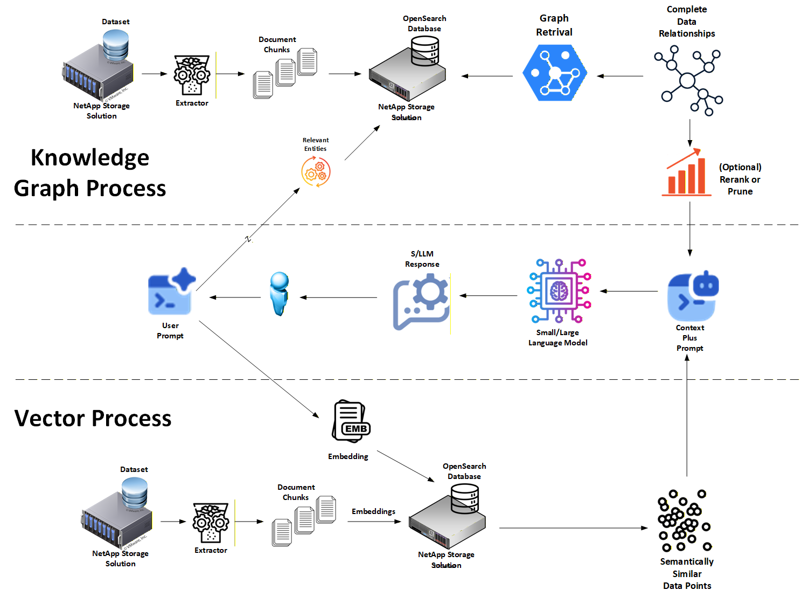

# Hybrid RAG Using Knowledge Graphs: Better Option for AI Governance

Welcome to the **Hybrid RAG Guide Using Knowledge Graphs**: a dual-memory (LT + HOT) **Graph + Vector** approach to Retrieval-Augmented Generation that delivers answers that are **traceable, explainable, and governance-ready** by design.

This repo implements a **Hybrid RAG Using Graph** pattern where:

- **GraphRAG (Knowledge Graph)** provides **truth grounding** using explicit entities + relationships (triplets) extracted from source documents.
- **VectorRAG (Embeddings)** provides **contextual awareness** via semantic similarity over document chunks.
- The agent **combines both contexts** for answer generation, leveraging the strengths of each (structured facts + semantic nuance).

The Graph + Vector Hybrid RAG methodology is based on the Hybrid RAG approach described in *"Hybrid RAG: Integrating Knowledge Graphs and Vector Retrieval Augmented Generation for Efficient Information Extraction"* ([arXiv:2408.04948](https://arxiv.org/abs/2408.04948)). The strongest public signal that this hybrid approach works at scale comes from this BlackRock and NVIDIA’s HybridRAG research paper. They pair graph traversals for grounded evidence with vector recall as a fallback, and report 96% factual faithfulness on answers.



By storing truth as **entities and relationships with metadata** (instead of relying on lexical ranking alone), the system gains stronger provenance, reduces hallucinations, and supports demanding audit requirements. 

## Project Purpose

This project exists because vector-only RAG is great at "semantic vibes" and terrible at "providing correct answers to user's questions".

Hybrid RAG improves governance by separating concerns:

- **Truth grounding:** done through a **Knowledge Graph** built from extracted triplets (subject → relation → object) with metadata.
- **Context enrichment:** done through **vector retrieval** over text chunks to provide surrounding detail, nuance, and supporting explanation.

Key objectives include:

- Provide a reference architecture for **Hybrid RAG (Graph + Vector)** with explicit **HOT (unstable)** and **Long-Term (LT)** memory tiers.
- Make promotion from **HOT → LT** a **controlled event** that happens only when (1) there is **enough positive reinforcement** of the data **or** (2) a **trusted human-in-the-loop** has verified it.

## Benefits Over Vector-Based RAG

Vector-only RAG excels at semantic similar text (which are not answers by the way... just very comparable text), but governance teams do not sign off on "trust me, the cosine or vector math said so."

Graph-grounded Hybrid RAG provides:

- **Deterministic Fact Traceability:** Grounding facts as entities + relationships provides human-readable "why this fact is here."
- **Audit-Ready Provenance:** Triplets and node/edge metadata can capture source lineage (doc_version, ingested_at, etc.), enabling verifiable attribution.
- **Mitigation of Semantic Drift:** The graph constrains grounding to explicit extracted relationships, limiting irrelevant context from "nearby vectors."
- **Operational Explainability:** Graph retrieval can be shown as a subgraph (entities, edges, metadata) rather than opaque ANN rankings alone.
- **Contextual Completeness:** Vectors still retrieve supporting narrative context, so responses are not limited to terse triplets.

## Data Relationships


The following breaks down the data relationships and operational characteristics of three retrieval methodologies:

### Vector Embeddings (Approximate Nearest Neighbor)

- **Isolated data points:** content represented as high-dimensional vectors.
- **Semantic proximity:** retrieval by similarity distance.
- **Limitations:** can retrieve "mathematically near" but contextually wrong chunks (semantic drift).

### Knowledge Graph (Truth Grounding)

- **Explicit relationships:** entities are nodes; relationships are edges.
- **Subgraph retrieval:** queries retrieve relevant entities/edges and their neighborhood.
- **Strengths:** supports relational grounding, multi-hop reasoning, and provenance-friendly evidence.

### Hybrid Graph + Vector (Hybrid RAG)

- **Best of both worlds:** graph provides structured facts; vectors provide narrative context.
- **More robust retrieval:** graph handles extractive/entity questions well; vectors handle abstractive/context questions well.
- **Governance-friendly:** grounding can be audited as a subgraph + source metadata, with semantic context as supporting evidence.

## Where To Dive Deeper

| Hybrid RAG                                   | What it covers                                                                 |
| ------------------------------------------- | ------------------------------------------------------------------------------ |
| **Hybrid Graph Search for Better AI Governance** | Vision & governance rationale for Graph+Vector Hybrid RAG [link](./Hybrid_Search_for_Better_AI_Governance.md) |
| **Code Walkthrough**                 | Step-by-step walkthrough on the implementation [link](./Code_Walkthrough.md) |
| **Project README**                        | Hands-on commands & scripts [link](./src/README.md)              |

## Quick Start

```bash
# 1. Clone the repo
$ git clone https://github.com/davidvonthenen/hybrid-rag-graph-with-ai-governance.git

# 2. Exercise the code
$ cd hybrid-rag-graph-with-ai-governance/src  # laptop demo or open source deployment

# 3. Follow the README in that folder
```
